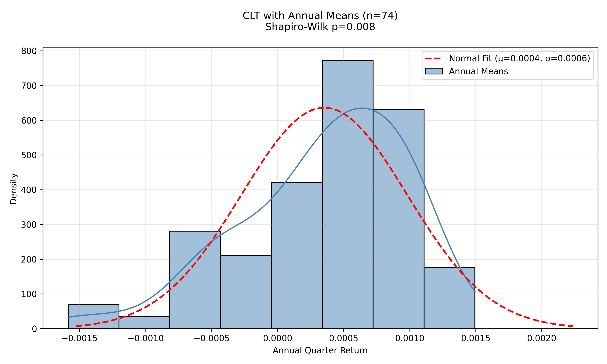

Scripts are located in /src

Results of the scripts are located in /data

# S&P 500 Analysis: Normal Distributions, Confidence Intervals, and the Central Limit Theorem

## **1. Objectives**
1. **Explore** the distribution of daily returns of the S&P 500 from 2008–2023.  
2. **Test normality** using the Shapiro-Wilk test and QQ-plot.  
3. **Display confidence intervals** with Monte Carlo simulations.  
4. **Illustrate the Central Limit Theorem** on annual mean returns from 1950-2023.  

---

## **2. Methodology**

### **1. Data Parsing (fetchdata.py)**
- **Source**: Yahoo Finance via `yfinance`.  
- **Steps**:  
  1. Download raw OHLCV data.  
  2. Compute daily returns using `.pct_change()`.  
  3. Save the processed data to a CSV file.  

---

### **2. Descriptive Statistics of Daily Returns (graphs.py)**

#### **Summary Statistics**
The following statistics were computed for the daily returns of the S&P 500 from 2008 to 2023:  
- **Mean**: 0.000380  
- **Standard Deviation**: 0.012919  

#### **Histogram and QQ-Plot**
- A histogram (returns_histogram.png) of the daily returns was plotted and compared to a fitted normal distribution with the same mean and standard deviation.  
- A Quantile-Quantile (QQ) plot (qqplot_daily.png) was generated to compare the quantiles of the daily returns to those of a standard normal distribution.


#### **Shapiro-Wilk Test**
- The Shapiro-Wilk test was performed to assess whether the daily returns follow a normal distribution.  
- **P-value**: `0.0000`.  

#### **Interpretation**
- The histogram shows that the daily returns of the S&P 500 are not perfectly symmetric and have more extreme values than a normal distribution.
- The QQ-plot further highlights this deviation, particularly in the extreme tails, where the data points diverge significantly from the diagonal line.  
- The Shapiro-Wilk test confirms this observation, with a p-value of `0.0000`. This suggests that the daily returns do not follow a normal distribution.  

---

### **3. Confidence Intervals with Monte Carlo Simulations (confidenceintervals.py)**

#### **Monte Carlo Process**
- Random daily returns are generated for each path using `np.random.normal(μ, σ, days)`.  
- Cumulative returns for each path are computed using `(1 + random_returns).cumprod()`.  
- All paths are stored in a 2D array of shape `(days, n_simulations)`.  

#### **Confidence Intervals**
- For each day, the **2.5th percentile** (lower bound) and **97.5th percentile** (upper bound) are calculated across all simulated paths.  
- The **median path** is also computed to represent the central tendency.  

#### **Interpretation (cumulative_returns_fan_chat.png)**
- The confidence intervals highlight the range of potential cumulative returns over the specified time horizon:  
  - The **width of the confidence interval** widens over time, showing increasing uncertainty.
  - The **median path** suggests the most likely trajectory, but the wide range of possible outcomes underscores the inherent risk.
 


---

### **4. Central Limit Theorem on Annual Mean Returns (graphs.py)**

#### **Summary Statistics**
- **Mean**: 0.000353  
- **Standard Deviation**: 0.000627  

#### **Histogram and QQ-Plot**
- A histogram (clt_annual_means.png) of the annual means was plotted and compared to a fitted normal distribution with the same mean and standard deviation.  
- A Quantile-Quantile (QQ) plot (qqplot_annual.png) was generated to compare the quantiles of the daily returns to those of a standard normal distribution.




#### **Interpretation**
- Although the Shapiro–Wilk test generates a p‑value below 0.05 (`0.0082`), indicating it is not normally distributed, it is much higher than that for daily returns, suggesting the distribution of annual means is closer to Gaussian.
- Increasing the number of observations (e.g., years of returns) would further help reduce the impact of extremes, bringing the distribution of means closer to normal.

---

## **Conclusion**

This project provided a comprehensive analysis of the S&P 500 returns, focusing on their distribution, confidence intervals, and the Central Limit Theorem. The key findings are as follows:

1. **Daily Returns**: The analysis of daily returns from 2008–2023 revealed that they do not follow a normal distribution. The Shapiro-Wilk test, histogram, and QQ-plot all highlighted significant deviations, particularly in the tails.

2. **Confidence Intervals**: Monte Carlo simulations demonstrated the range of potential cumulative returns over time. The widening confidence intervals underscored the increasing uncertainty in future returns, while the median path provided a central tendency for expected outcomes.

3. **Annual Mean Returns**: By examining annual mean returns from 1950–2023, the distribution was closer to normal than daily returns. Although the Shapiro-Wilk test still rejected normality, the higher p-value and visual assessments suggested that increasing the number of observations would further align the distribution with Gaussian behavior.

## Installation Guide

### Setup

1. **Clone the repository**

   ```bash
   git clone https://github.com/andrcode1/Statistics_Project.git
   cd Statistics_Project
   ```

2. **Create and activate a virtual environment (Only necessary if you want to run the scripts again)**

   ```bash
   python3 -m venv venv
   source venv/bin/activate   # On Windows: venv\Scripts\activate
   ```

3. **Install dependencies**

   ```bash
   pip install -r requirements.txt
   ```
